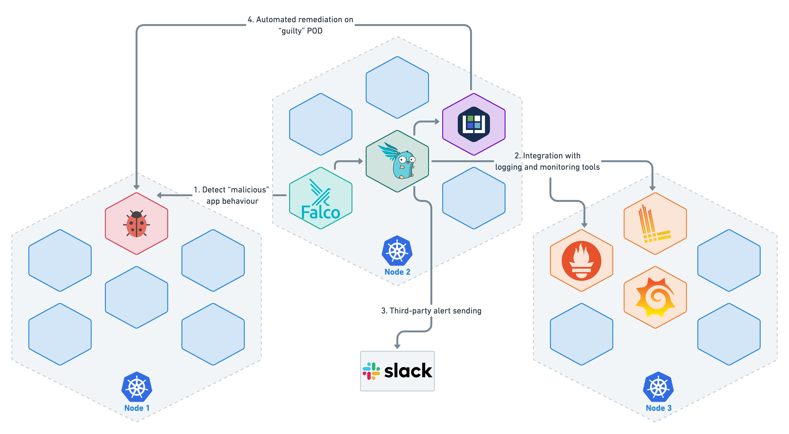

# Falco & Falcosidekick: Observability, Security, Monitoring and Automation in K8S environment [Talk ContainerDay 2021]


This repository contains slides and demo code presented during the [ContainerDay 2021](https://2021.containerday.it/) event hosted by [Grusp](https://www.grusp.org/): https://2021.containerday.it/talks_speakers/#andrea-v (sorry foreign fellows... it's an italian talk)

# Slides content
You can find an english translation of the slides [here](./slides/)

# Demo Architecture


## Scope of the Demo
Let's take a practical example and consider the following use case:
- Requirements
	- Simple Kubernetes cluster as a starting point
	- Test POD deployed on the cluster with "malicious" behavior
		- ES: detect a network connection to a specific URL
		- ES: detect an unauthorized shell in the POD
    - Goals
        - Test the Falco Rules and intercept any violations
        - Integration for long-term monitoring (Loki, Prometheus, Grafana)
		- Integration with external alerting system (a Slack chhannel for example)
        - Implement automated remediation for the second violations
			- We simulate to apply a Kubernetes Network Policy to isolate and deny the outgoing traffic of the POD when we receive a network connection to vistatech.it website IPs

## How to reproduce the demo environment
Visit the [HowTo](./howto/) section

## POI (Point Of Interest)

### The Custom Falco Rule
We will simulate the "maliciuos" behaviour in 2 ways. The first one (detect an unauthorized shell in the POD) will use a standard default Falco Rules already present in the libraries. For the second test we have to create a custom Falco Rule for the scope.

In particlar we have to match the following requirements:
- Declare a list of IPs to be detected
- Detect an outbound network connection towards those IPs

Here the YAML definition of the Rule

```yaml
- list: website_ips
  items: ['"213.215.222.58"', '"213.215.222.59"']

- rule: Connection to vistatech.it
  desc: Detect attempts to connect to Vista Technology website 
  condition: outbound and fd.sip in (website_ips)
  output: Outbound connection to Vista Technology website https://www.vistatech.it 
        (command=%proc.cmdline connection=%fd.name container_id=%container.id container_name=%container.name 
        %container.info image=%container.image)
  priority: WARNING
  tags: [network]
```

As we can see, in the rule condition we are re-using some pre-writter Falco code, AKA macro: outbound.
Here the defintion of that macro (just for curiosity... we don't need to specify the macro again, it's already present and loaded).

```yaml
- macro: outbound
  condition: >
    (((evt.type = connect and evt.dir=<)) or
    (fd.typechar = 4 or fd.typechar = 6) and
    (fd.ip != "0.0.0.0" and fd.net != "127.0.0.0/8") and
    (evt.rawres >= 0 or evt.res = EINPROGRESS))
```

We can put the YAML definition code inside a file and pass this file when installing Falco, to allow Falco to load this Rule.

### The Serverless function

As we said before, we want to react to an event of outbound network traffic towards some specifi IPs. A possibile remediation would be to produce, in an automated way, a Kubernetes Netork Policy to patch a poissibile security breach.

This network policy will be resposible to deny all egress traffic from the POD.

Here a YAML example of the Network Policy definition

```yaml

apiVersion: networking.k8s.io/v1
kind: NetworkPolicy
metadata:
  name: default-deny-egress
spec:
  podSelector:
    matchLabels:
      app: nginx
  policyTypes:
  - Egress

```

To automate the creation of the Network Policy we use a Python serverless function based on the Kubeless framework.

Here the Python code of the function

```python
from kubernetes import client,config
config.load_incluster_config()

def isolate_pod(event, context):
    rule = event['data']['rule'] or None
    output_fields = event['data']['output_fields'] or None

    if rule and rule == "Connection to vistatech.it" and output_fields:
        if output_fields['k8s.ns.name'] and output_fields['k8s.pod.name']:
			pod = output_fields['k8s.pod.name']
			namespace = output_fields['k8s.ns.name'] 
			body = client.V1NetworkPolicy(
				api_version="networking.k8s.io/v1",
				kind="NetworkPolicy",
				metadata=client.V1ObjectMeta(name="default-deny-egress"),
				spec=client.V1NetworkPolicySpec(
					pod_selector=client.V1LabelSelector(
						match_labels= {"app":"nginx"}),
						policy_types=["Egress"]))
						
			print (f"Isolating pod \"{pod}\" in namespace \"{namespace}\"")
			client.NetworkingV1Api().create_namespaced_network_policy(namespace=namespace, body=body)
```

## Test the whole architecture

Open a bash shell on our Nginx POD and check the outbound connection with a simple cURL command
```shell
ubuntu@containerday21:~$ kubectl -n demo exec -it nginx -- /bin/bash

root@nginx:/# curl -k https://vistatech.it
<!DOCTYPE html>
<html class="full" lang="it">
	<head>
		<meta charset="utf-8">
		<meta http-equiv="X-UA-Compatible" content="IE=edge">
		<meta name="viewport" content="width=device-width, initial-scale=1">
        <title>VISTA | Home page: ICT System Integrator</title>
    <meta name="title" content="VISTA | Home page: ICT System Integrator"/>
    <meta name="keywords" content="vista technology,data center,sicurezza informatica,performance,software defined network,noc"/>

.....

.....

```

We can check in Grafana our dashboard and Loki logs


We can also see that some alerts came to our Slack


The last thing that we have to check is the remediatin function.
If all went good we expect to see a brand new NetworkPolicy, to disallow egress traffic, associated to our POD

```shell
ubuntu@containerday21:~$ kubectl get networkpolicies -n demo
NAME                  POD-SELECTOR   AGE
default-deny-egress   app=nginx      8m44s
```
So, now it will be impossibile to navigate again

```shell
ubuntu@containerday21:~$ kubectl -n demo exec -it nginx -- /bin/bash

root@nginx:/# curl -k https://vistatech.it

curl: (6) Could not resolve host: vistatech.it
```

And... IT'S DONE!
