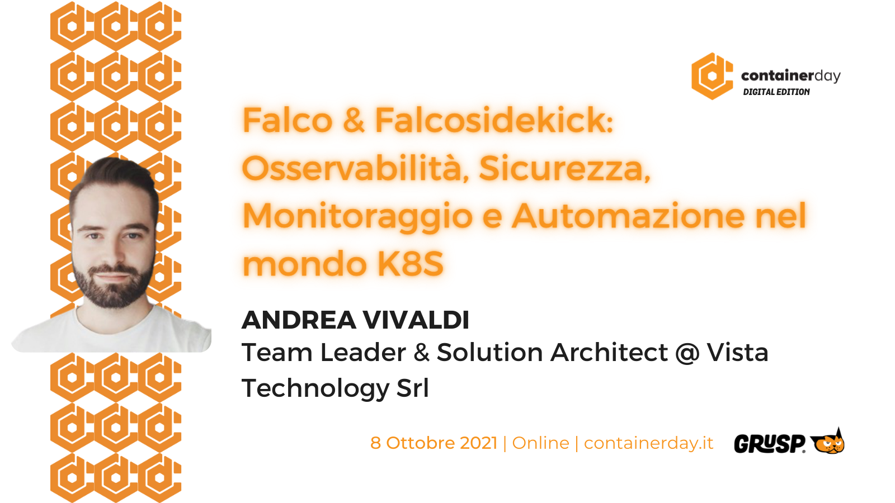
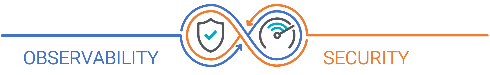
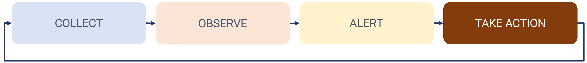
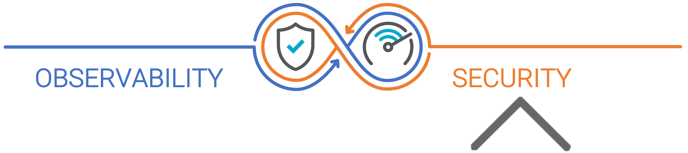
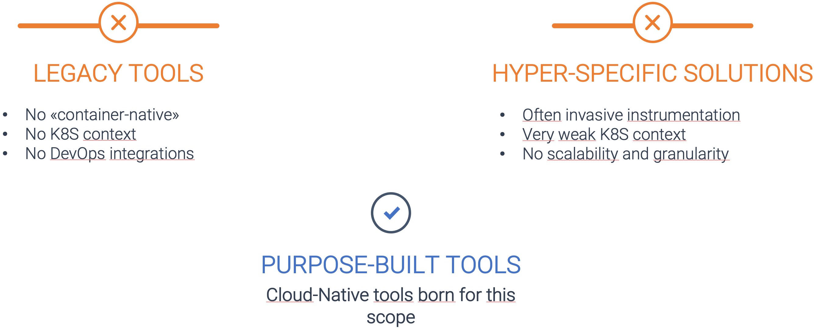
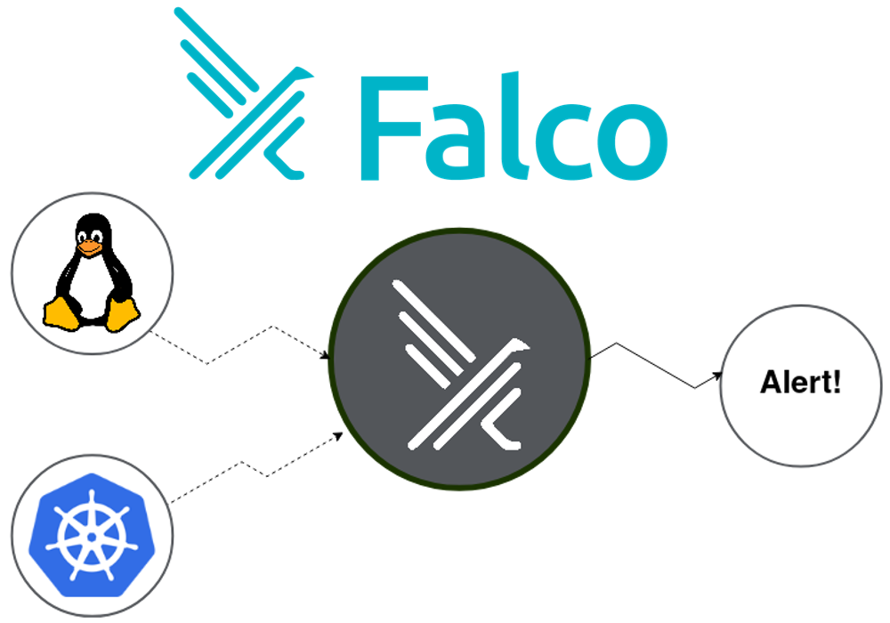
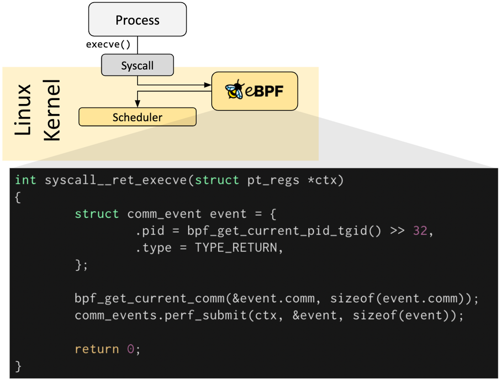
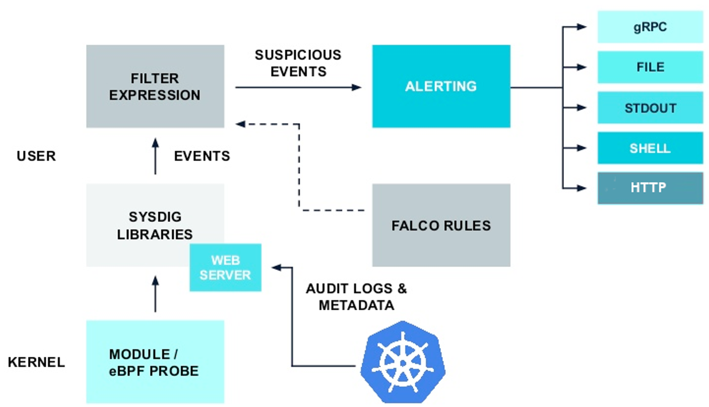
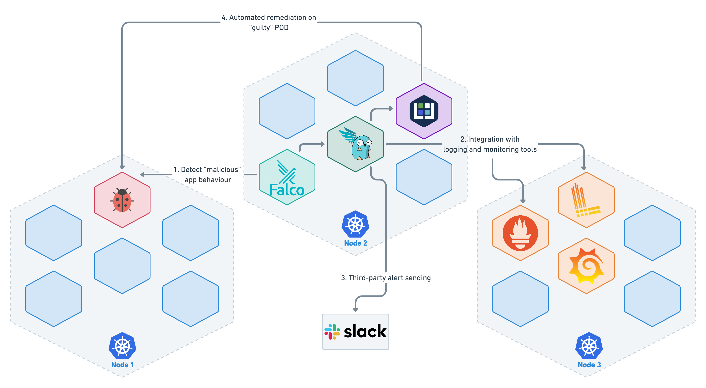

---

# LET ME INTRODUCE MYSELF

I'm Andrea Vivaldi
- I am Team Leader and Solution Architect, in the DevOps and Cloud Native enabling technologies, for Vista Technology
- I have always been passionate about Automation, Observability, Telemetry and Monitoring
- Lately I have been playing among Secure DevOps and Network Automation

---

# WHAT WE WILL TALK ABOUT TODAY

- Observability and Security in the K8S area
    - Critical issues
    - Importance of using the right tools
    - Closed-loop with Automation/Remediation
- EBPF Tools
    - Falco
    - Falcosidekick
- DEMO
    - Practical examples (very "opinionated") on a possible stack to use

---

# DISCLAIMER

- It is not a technical in-depth talk on eBPF technology
- It is not a deep dive on Falco
- Not a deep dive on Kubeless and Serverless features

... So what's all about?
- Simply a case study on how to start approaching and using innovative technologies for "hot" topics in K8S and Secure DevOps ... from the point of view of a humble user

---

# LET'S START FROM A ASSUMPTION

- Kubernetes is the «new» OS in the Cloud Native and Microservices world
- New drivers:
    - Speed ​​and innovation
    - Efficiency exasperated in the cost / benefit ratio
    - Continuous risk mitigation
- The new challenges of the DevOps teams: Secure DevOps



---

# «CLOUD-NATIVE» ERA: NEW CHALLENGES
- *"All"* OPS approach
    - Everything from network infrastructures to servers to application development is based on the principles and practices of DevOps
    - Common context between heterogeneous teams
- Hyper-fragmentation
    - Microservices-oriented architectures
- Speed ​​and resilience
    - Need to speed up the release processes and the collection of feedback data
- Ephemeral components
    - "I can't measure what I can't see"

---

# CLOSED-LOOP TELEMETRY E AUTOMATION

- **CONTINUOUS FEEDBACK**
    - Integrate continuous monitoring & observability into your CI / CD processes, to get real-time feedback
- **PERFORMANCE**
    - Obtain the most sensitive data, out-of-the-box, in the shortest possible time, extract and view it in an agile way


---

# CLOSED-LOOP TELEMETRY E AUTOMATION

- **COVERAGE**
    - Ensure full access and alarms to operators
- **AUTOMATION**
    - Having data that is useful for toolchains, so that they can react to events and trigger automations


---

# SO... where is Security?


- The observability and telemetry functionalities are the **«source»** for the security and auditing processes
    - K8S Audit Log integration
    - Runtime detection & protection
    - Performance & Capabilities
    - ...

---

# BUT I ALREADY HAVE SO MANY TOOLS AVAILABLE ...



---

# A POSSIBLE  WAY: FALCO

- **Open Source**
- Created by **Sysdig** in 2016
- The very first runtime security project to be "*incubated*" within the CNCF

---

# A POSSIBLE  WAY: FALCO
- Cloud Native **runtime Security & Visibility**
- **Threat Detection** Engine, de-facto standard in the K8S environment
- It uses **eBPF** technology to intercept
    - System calls
    - Kernel events
    - Kubernetes audit events
- **Monitoring** of the behavior of a cluster from all points of view
    - Access to sensitive data
    - Cluster node activity
    - POD activity

---

# eBPF (... JUST A HINT ...)
- *Extended Berkeley Paket Filter*
- **Kernel** technology that allows programs to run as if they were inside a **sandbox**, where they can benefit from specific kernel **capabilities** without adding modules or touching the source code
- EBPF programs are **event-driven** and run when the kernel or application passes through a certain **hook**

---

# eBPF (... JUST A HINT ...)


---

# INTERESTING… AND HOW DOES FALCO WORK?


---

# INTERESTING… AND HOW DOES FALCO WORK?
- Falco uses the data collected by the kernel drivers to:
    - Parsing system calls at the Kernel level
    - Check the data against the Rules engine
    - Alert in output in case of violation

---


# What's FALCO looking for?
- A shell opened inside a container/POD in Kubernetes
- A container that runs in privileged mode, or that mounts a sensitive path directly from the host (eg: /proc)
- A server process that spawns a child process unexpectedly
- Unexpected reading of particular files, such as /etc/shadow
- A non-device file written under /dev
- A standard system binary, such as ls, which makes a connection to the outside
- *(and much much more...)*

---

# BENEFITS OF USING FALCO
- All the **magic** happens at the **Kernel** level, so:
    - **Minimum impact** on **performance** and systems
    - Maximum data **granularity**
- Naturally designed to work in a K8S-oriented world
    - Integration with **Audit Logs & Events**
    - Compatibility with deployment on any **Kubernetes** platform
- Same shared technology for **Host and Container**
- No need to add and manage container **sidecars**
- Very complete library of **predefined rules** for **detecting** malicious activity and CVE exploits
- **Integration** with de-facto standards in terms of **telemetry** and **monitoring**

---

# FALCOSIDEKICK: FALCO EXTENSION
- **Falco limit**: only 5 output formats (stdout, file, gRPC, shell, HTTP)
- How can I integrate and **make Falco interact** with other tools, for example to be able to create automations in remediation?
- **Falcosidekick comes into play**, a demon that listens to Falco's outputs and makes them available with a large number of third-party connectors
    - Chat
    - Metrics
    - Alerting
    - Logs
    - Object Storage
    - FaaS/Serverless
    - ...

---

# UNDERSTOOD! NOW WE PUT ALL THE PIECES TOGETHER...
- Let's take a practical example and consider the following use case:
    - Requirements
        - Simple Kubernetes cluster as a starting point
        - Test POD deployed on the cluster with "malicious" behavior
            - ES: detect a network connection to a specific URL
            - ES: detect an unauthorized shell in the POD
    - Goals
        - Step 1: Test the Falco Rules and intercept any violations
        - Step 2: Integration for long-term monitoring
        - Step 3: Implement automated remediation

---

# STEP 1
- Installation of Falco, through Helm, within a dedicated namespace
- Adding a Falco Custom Rule
    - Detect network outgoing traffic to some IP addresses: 213.215.222.58, 213.215.222.59 (https://www.vistatech.it)
- Deploy "malicious" apps
    - ES: POD Nginx
- Behavior test
    - Open a terminal shell
    - Execution of a cURL to https://www.vistatech.it
- Analysis of Falco results produced in STDOUT
    - Verify that the above events are trapped in the logs

---

# ANAOMY OF A FALCO RULE

```yaml
- macro: outbound
  condition: >
    (((evt.type = connect and evt.dir=<)) or
    (fd.typechar = 4 or fd.typechar = 6) and
    (fd.ip != "0.0.0.0" and fd.net != "127.0.0.0/8") and
    (evt.rawres >= 0 or evt.res = EINPROGRESS))

- list: website_ips
  items: ['"213.215.222.58"', '"213.215.222.59"']

- rule: Connection to vistatech.it
  desc: Detect attempts to connect to Vista Technology website 
  condition: outbound and fd.sip in (website_ips)
  output: Outbound connection to Vista Technology website https://www.vistatech.it 
        (command=%proc.cmdline connection=%fd.name container_id=%container.id container_name=%container.name 
        %container.info image=%container.image)
  priority: WARNING
  tags: [network]
```
---
# STEP 2
- Persist information within a telemetry/observability stack and hook an instant messaging system for notifications
- Let's install Falcosidekick (also via Helm)
    - Output to:
        - Loki
        - Prometheus (via additional scrape config of the endpoint / metrics)
        - Slack
        - Kubeless function (which will be used for Step 3)
- Let's generate events again and observe the results on the Grafana dashboards
- We can also access the Falcosidekick UI for a first high-level view

---

# STEP 3
- Let's take a last step to go in the direction of a "closed loop" between observability and automation (in this case remediation)
- We use Falcosidekick to trigger a serverless function (with Kubeless)
    - This function will intercept the Custom Rule event "Connection to vistatech.it" and will simulate a remedy simply by creating a NetworkPolicy to prohibit outgoing traffic
    - After the first cURL, the Ngnix POD will no longer be able to make network connections to the outside

---

# SERVERLESS FUNCTION

```python
from kubernetes import client,config
config.load_incluster_config()
def isolate_pod(event, context):
    rule = event['data']['rule'] or None
    output_fields = event['data']['output_fields'] or None
    if rule and rule == "Connection to vistatech.it" and output_fields:
        if output_fields['k8s.ns.name'] and output_fields['k8s.pod.name']:
            pod = output_fields['k8s.pod.name']
            namespace = output_fields['k8s.ns.name'] 
            body = client.V1NetworkPolicy(
                api_version="networking.k8s.io/v1",
                kind="NetworkPolicy",
                metadata=client.V1ObjectMeta(name="default-deny-egress"),
                spec=client.V1NetworkPolicySpec(
                    pod_selector=client.V1LabelSelector(
                        match_labels= {"app":"nginx"}),
                        policy_types=["Egress"]))
            print (f"Isolating pod \"{pod}\" in namespace \"{namespace}\"")
            client.NetworkingV1Api().create_namespaced_network_policy(namespace=namespace, body=body)
```

---

# Let'sum up... THE FINAL SCHEME


---
# 
*DEMO*

---

# CREDITS
https://sysdig.com/blog/
https://falco.org/docs/
https://github.com/falcosecurity/falco
https://github.com/falcosecurity/falcosidekick
https://ebpf.io/what-is-ebpf/
https://falco.org/blog/falco-on-rke-with-rancher/
https://github.com/falcosecurity/charts/tree/master/falco
https://falco.org/blog/intro-k8s-security-monitoring/
https://falco.org/blog/falco-kind-prometheus-grafana/
https://falco.org/blog/extend-falco-outputs-with-falcosidekick/
https://falco.org/blog/falcosidekick-response-engine-part-1-kubeless/
https://sysdig.com/blog/unexpected-domain-connection/

---
# 
*THANKS TO ALL FOR YOUR ATTENTION! ANY QUESTIONS?*